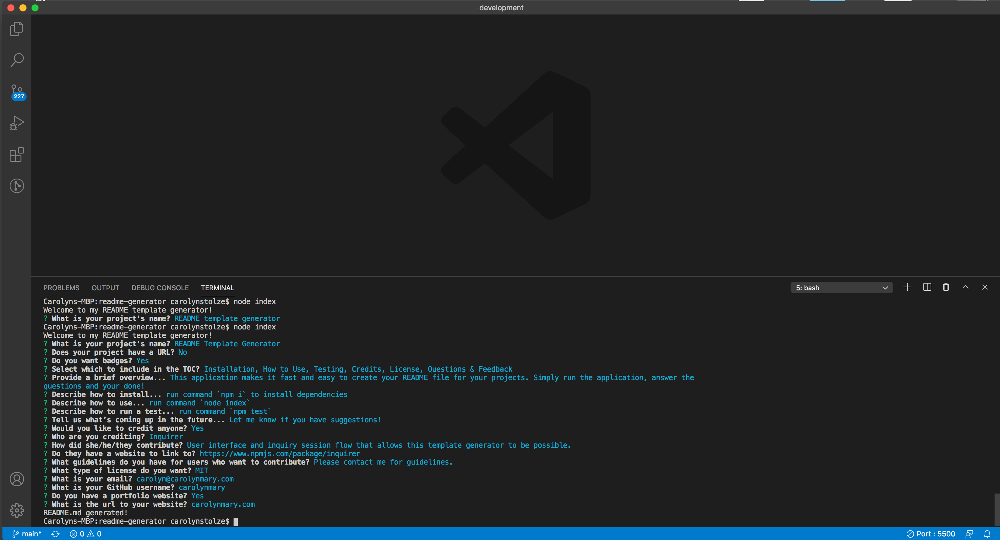
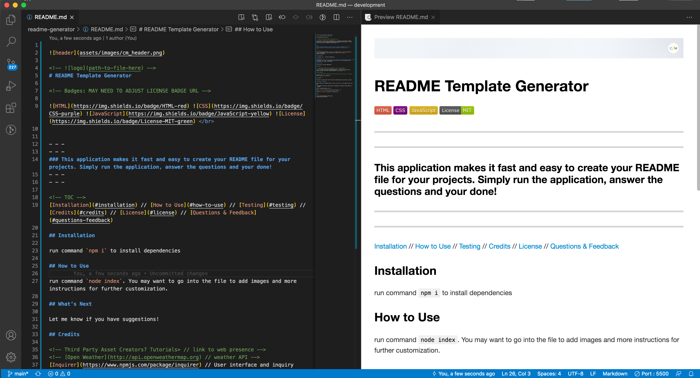

<!--  -->
# README Template Generator 
  
<!-- Badges: MAY NEED TO ADJUST LICENSE BADGE URL -->

     
 
  
- - -
- - -
### This application makes it fast and easy to create your README file for your projects. Simply run the application, answer the questions and your done!
- - -
- - -

<!-- TOC -->
[Installation](#installation) // [How to Use](#how-to-use) // [What’s Next](#next) // [Credits](#credits) // [Contributing](#contributing) // [License](#license) // [Questions & Feedback](#questions--feedback) 

## Installation
  
run command `npm i` to install dependencies

## How to Use 
  
run command `node index`. A series of questions will pop up, fill in the blanks and you're on your way.
 

Your file will be generated as "README.md" in your current folder. You may want to go into the file to add images, more instructions or any other further customization to describe your project.

## What’s Next

Let me know if you have suggestions!

## Credits
  
<!-- Third Party Asset Creators? Tutorials> // link to web presence -->
<!-- [Open Weather](http://api.openweathermap.org) // weather API -->
[Inquirer](https://www.npmjs.com/package/inquirer) // User interface and inquiry session flow that allows this template generator to be possible.  

## Contributing

<!-- The [Contributor Covenant](https://www.contributor-covenant.org/) is an industry standard. -->
Please contact me for guidelines.

## License
    
The code is licensed under the [MIT](https://choosealicense.com/licenses//) License.
  
## Questions & Feedback
  
Have a question or feedback? Send me a note or just say hi, I'd be happy to hear from you!
  
> “Knowledge is having the right answer. Intelligence is asking the right question.” ~ Unknown
  
Email: carolyn@carolynmary.com  
  
GitHub: [carolynmary](https://github.com/carolynmary)  
  
Porfolio: [carolynmary.com](https://carolynmary.com) 

 
 

© 2020 Carolyn Mary Stolze
  